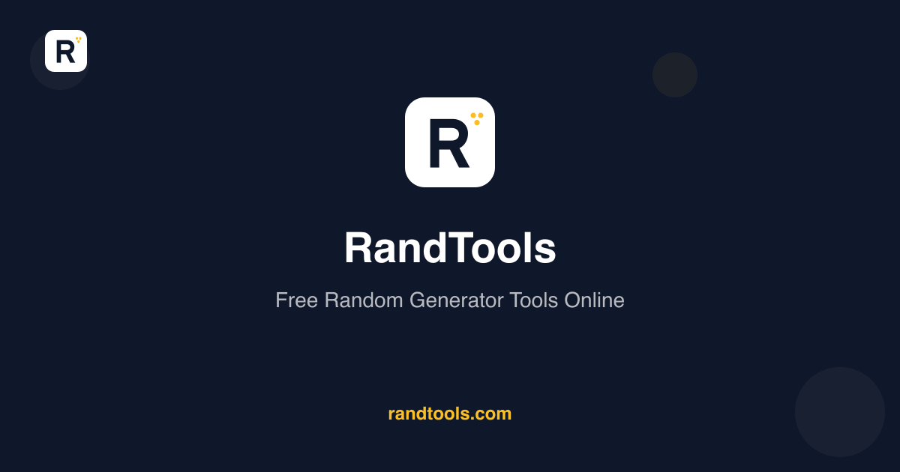
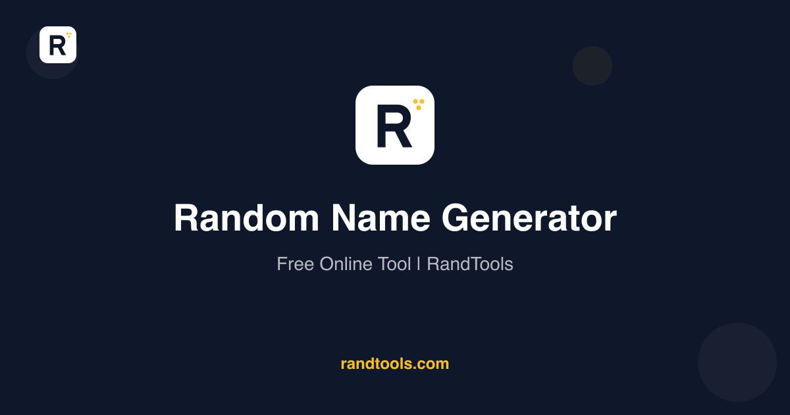
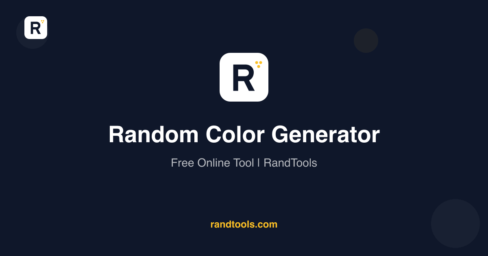

  

  # RandTools

  **Free random generator tools — 65+ generators and 14 combo tools, all running 100% in your browser.**

  
  
  

  

---

> 📖 **The story behind this site:** [I haven't written code in a year. Last week I forgot to git push and panicked.](https://dev.to/flreey/i-havent-written-code-in-a-year-last-week-i-forgot-to-git-push-and-panicked-16f5) — a developer's confession about building RandTools without writing a line of code.

---

## What is RandTools?

[**RandTools**](https://randtools.com) is a free online suite of random generator tools designed for developers, designers, writers, QA engineers, tabletop gamers, and decision-makers. Instead of bookmarking five different sites for random names, fake addresses, UUIDs, colors, and dice rolls, RandTools puts everything in one fast, modern, no-tracking interface.

Unlike traditional generators that produce isolated random fields, RandTools also provides **combo tools** that generate coherent multi-field outputs — a fake person whose street, city, state, and zip code actually match real US geography; a mock dataset where every row is internally consistent. All randomization happens **client-side in your browser**, so no inputs or outputs ever leave your machine.

## ✨ Key Features

- 🧪 **65+ atomic generators** — names, passwords, UUIDs, colors, gradients, dice, fake emails, lorem ipsum, jokes, riddles, and more
- 🧰 **14 combo tools** — fake-person, fake-address, fake-company, mock-data, character cards, color schemes, and more
- 🌐 **100% client-side** — generation happens in your browser; nothing leaves your device
- ⚡ **Statically generated** — sub-second load times via Cloudflare Workers
- 🔒 **No signup, no tracking** — free and ad-light, forever
- 📱 **Mobile-friendly** — works on every device
- 🎨 **Enriched results** — movie suggestions show director / year / rating, country results show capital / population / language, and more

## 📸 Preview

<table>
  <tr>
    <td align="center">
       
      <a href="https://randtools.com/random-name-generator">Random Name Generator</a>
    </td>
    <td align="center">
       
      <a href="https://randtools.com/random-color-generator">Random Color Generator</a>
    </td>
    <td align="center">
       
      <a href="https://randtools.com/random-movie-generator">Random Movie Generator</a>
    </td>
  </tr>
</table>

## 🛠 Built With

- **[Next.js 16](https://nextjs.org)** — App Router with Turbopack for static site generation
- **[React 19](https://react.dev)** + **[TypeScript](https://www.typescriptlang.org)** — UI layer
- **[Tailwind CSS 4](https://tailwindcss.com)** — Styling
- **[@faker-js/faker](https://fakerjs.dev)** — Locale-aware fake data (lazy-loaded)
- **[Cloudflare Workers](https://workers.cloudflare.com)** + **[OpenNext](https://opennext.js.org)** — Edge deployment
- **[Cloudflare R2](https://www.cloudflare.com/products/r2/)** — Incremental cache storage

## 🎯 Popular Tools

### For Developers & QA
- [Mock Data Generator](https://randtools.com/mock-data-generator) — Generate consistent test datasets
- [Fake Person Generator](https://randtools.com/fake-person-generator) — Realistic fake users with matching fields
- [Fake Address Generator](https://randtools.com/fake-address-generator) — Geographically-coherent US addresses
- [Fake Company Generator](https://randtools.com/fake-company-generator) — Plausible company profiles
- [UUID Generator](https://randtools.com/uuid-generator) — RFC 4122 UUIDs
- [Random Password Generator](https://randtools.com/random-password-generator) — Secure passwords with custom rules
- [Random IP Address Generator](https://randtools.com/random-ip-address-generator) — IPv4 addresses

### For Designers
- [Random Color Generator](https://randtools.com/random-color-generator) — HEX/RGB/HSL with palette
- [Random Gradient Generator](https://randtools.com/random-gradient-generator) — CSS-ready linear gradients
- [Random Color Palette Generator](https://randtools.com/random-color-palette-generator) — 5-color schemes
- [Random Emoji Generator](https://randtools.com/random-emoji-generator) — Random emoji picker

### For Writers & Creators
- [Random Word Generator](https://randtools.com/random-word-generator)
- [Random Sentence Generator](https://randtools.com/random-sentence-generator)
- [Random Topic Generator](https://randtools.com/random-topic-generator)
- [Random Question Generator](https://randtools.com/random-question-generator)
- [Lorem Ipsum Generator](https://randtools.com/lorem-ipsum-generator)
- [Random Quote Generator](https://randtools.com/random-quote-generator)

### For Gamers & Decision-Makers
- [Random Dice Roller](https://randtools.com/random-dice-generator)
- [Coin Flip Generator](https://randtools.com/coin-flip-generator)
- [Yes or No Generator](https://randtools.com/yes-or-no-generator)
- [Random Card Generator](https://randtools.com/random-card-generator)
- [Truth or Dare Generator](https://randtools.com/truth-or-dare-generator)
- [Random Riddle Generator](https://randtools.com/random-riddle-generator)
- [Random Joke Generator](https://randtools.com/random-joke-generator)

[See all 65+ generators →](https://randtools.com/all-generators)

## ❓ Frequently Asked Questions

<b>Is RandTools really free?</b>

 
Yes. RandTools is free to use with no signup required. There are no usage limits, no premium tiers, and no paywalls. A single non-intrusive ad unit helps keep the lights on.

<b>Are the random outputs really random?</b>

 
RandTools uses the browser's <code>crypto</code> APIs (including <code>crypto.randomUUID()</code> and <code>crypto.getRandomValues()</code>) for cryptographically-secure randomness on supported generators. List-based generators use <code>Math.random()</code>, which is fine for non-security uses.

<b>Does RandTools track what I generate?</b>

 
No. All generation happens entirely in your browser. No inputs or outputs ever touch our servers. We use Google Analytics for anonymous traffic stats only.

<b>Can I use the generated data commercially?</b>

 
Yes. All generated data (fake people, addresses, mock datasets, etc.) is freely usable for any purpose — commercial, personal, educational. The fake data is fictional and not associated with any real individuals.

<b>Do you have an API?</b>

 
Not yet. Currently RandTools is a browser-only tool. If you'd like to see an API or NPM package, <a href="https://github.com/flreey/randtools/issues/new">open an issue</a> with your use case.

## 🌟 Use Cases

- **Software testing** — generate realistic-looking users, addresses, and datasets for QA
- **Form validation** — test address parsers, email validators, and phone number formats
- **UI prototyping** — populate Figma/design mocks with believable placeholder data
- **Tabletop RPG sessions** — generate NPCs, settlements, fantasy names, and quest hooks
- **Writing & journaling** — daily prompts, sentence starters, conversation topics
- **Decision-making** — coin flips, yes/no decisions, restaurant pickers
- **Education** — random questions, study topics, vocabulary practice
- **Content creation** — blog post ideas, social media prompts, color palettes

## 🚀 Live

Visit **[randtools.com](https://randtools.com)** to start generating.

## 📬 Contact & Feedback

- **Issues & feature requests:** [open an issue](https://github.com/flreey/randtools/issues/new)
- **Website:** [randtools.com](https://randtools.com)

## 📄 License

The README content and project metadata in this repository are released under the [MIT License](./LICENSE). The RandTools website source code is maintained separately.

---

  Built with care · 100% client-side · No tracking · Free forever

